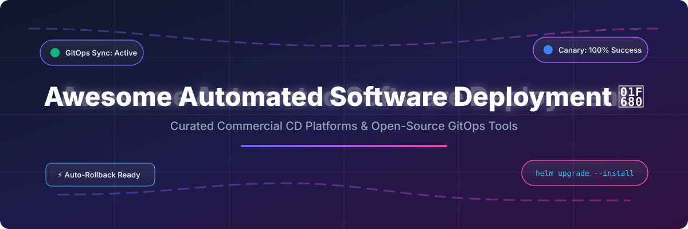

# Awesome-Automated-Software-Deployment

# Awesome-Automated-Software-Deployment 🚀 ⚙️

  

  
  
  
  
  
  

---

## 🌟 Top Automated Software Deployment Ecosystem

**Curated List of Commercial CD Platforms & Open-Source Deployment Orchestration Tools**  
*Focused on Continuous Delivery, GitOps, Progressive Delivery, Release Orchestration & Self-Hosted Deployment Pipelines*  

**Last updated: October 2026** 📅

---

### 📌 Overview & SEO Summary
Welcome to the ultimate curated directory of **automated software deployment platforms**, **GitOps continuous delivery tools**, and **open-source release orchestration frameworks**. Whether you are looking for enterprise-grade commercial solutions (such as *Harness CD*, *Octopus Deploy*, and *AWS CodeDeploy*), or self-hostable open-source alternatives (like *Argo CD*, *Flux CD*, *Spinnaker*, and *GoCD*), this list covers category leaders, declarative deployment engines, and privacy-respecting release automation.

---

## 📑 Table of Contents
- [🏢 SaaS & Commercial Platforms](#-saas--commercial-platforms)
- [🔓 Open-Source GitHub Projects](#-open-source-github-projects)
- [🛠️ How to Contribute](#%EF%B8%8F-how-to-contribute)
- [📊 Star History](#-star-history)
- [🤝 Support & Sponsorship](#-support--sponsorship)
- [⚠️ Disclaimer](#%EF%B8%8F-disclaimer)

---

## 🏢 SaaS / Commercial Platforms

The automated deployment market is dominated by cloud-native CI/CD platforms and specialized release orchestration tools. Pricing models vary dramatically: Harness uses a consumption-based HSU model ($0.75–$1.25 per unit) with 1,000 free units per month [citation:3][citation:13], Octopus Deploy charges per deployment target ($15,600/year for 25 targets, $770/year per additional tenant) with a free tier for 10 targets [citation:2], AWS CodeDeploy is free for EC2 deployments but charges $0.02 per on-premises instance update [citation:1][citation:11], and CircleCI uses a credit-based system with 30,000 free credits/month [citation:4].

| SaaS / Commercial Platform | Company / Owner | Valuation / Market Cap | Standard Edition Starting Price | Free Tier / Free Trial Limits | Description |
| :--- | :--- | :--- | :--- | :--- | :--- |
| **[Harness CD](https://www.harness.io/)** 🚀 | Harness | Private | $0.75/HSU (Essentials); $1.25/HSU (Enterprise) [citation:3] | **1,000 free HSUs/month** [citation:3] | **AI-powered continuous delivery** — Deploy any app to any cloud with built-in verification, automated rollbacks, and GitOps. Flex pricing lets you spend HSUs across CI, CD, IaC, and security modules [citation:3][citation:13]. |
| **[Octopus Deploy](https://octopus.com/)** 🐙 | Octopus Deploy | Private | $15,600/year (25 targets) [citation:2] | **Free tier: 10 projects, 10 tenants, 10 machines, 10 users** [citation:2] | **Deployment orchestration and release management** — Bi-directional Tentacle agent for Linux/Windows. Multi-tenancy and runbook automation. Volume discounts for 1,000+ targets [citation:2]. |
| **[AWS CodeDeploy](https://aws.amazon.com/codedeploy/)** ☁️ | Amazon | ~$2.0 Trillion | **Free for EC2**; $0.02/on-premises update [citation:1][citation:11] | No free tier for on-premises; EC2 deployments always free | **AWS-native deployment automation** — Deploys to EC2, Lambda, and on-premises servers. In-place and blue/green deployments with automatic rollback. |
| **[Azure Pipelines](https://azure.microsoft.com/en-us/products/devops/pipelines/)** 🔷 | Microsoft | ~$3.90 Trillion | Free for public projects; $6/user/month for private [citation:12] | **Free tier: 1,800 minutes/month, unlimited users** | **Azure DevOps CI/CD** — Build and release pipelines with YAML or classic editor. Deep Azure integration. Often bundled into Microsoft Enterprise Agreements [citation:12]. |
| **[GitLab CI/CD](https://docs.gitlab.com/ee/ci/)** 🦊 | GitLab | ~$8 Billion | Free tier: 400 CI/CD minutes/month; Premium from $29/user/month | **Free: 400 CI/CD minutes/month, 5 GB storage** | **All-in-one DevOps platform** — CI/CD, source control, and deployment in a single platform. Auto DevOps for zero-config pipelines. |
| **[CircleCI](https://circleci.com/)** ⚡ | CircleCI | Private | Performance: $15/month (30,000 credits) [citation:4] | **Free: 30,000 credits/month, 5 active users** [citation:4] | **Cloud-native CI/CD** — Credit-based pricing for compute. 30 concurrent Docker jobs on free tier. macOS and GPU support available [citation:4]. |
| **[GitHub Actions](https://github.com/features/actions)** 🐙 | Microsoft / GitHub | ~$3.90 Trillion | Free for public repos; usage-based for private | **Free: 2,000 CI/CD minutes/month for private repos** | **CI/CD integrated into GitHub** — Native workflow automation with 20,000+ marketplace actions. Matrix builds, reusable workflows, and OIDC authentication. |
| **[Codefresh](https://codefresh.io/)** 🎯 | Codefresh | Private | $99/month (starting) [citation:33] | **Free trial available** | **GitOps-native CI/CD** — Built on Argo. Progressive delivery, hybrid/on-prem deployment options. Overage rates $0.10–$0.50+ per build minute [citation:25]. |
| **[Spinnaker (Commercial Support)](https://spinnaker.io/)** 🏗️ | Armory / Various | N/A (Open Source) | Armory: Usage-based, contact sales [citation:24] | **Armory free: 25 app targets/month, 1,000 deployments** [citation:32] | **Multi-cloud continuous delivery** — Open-source core backed by Netflix, Google, Microsoft. Commercial support via Armory [citation:24]. |
| **[AWS CodePipeline](https://aws.amazon.com/codepipeline/)** ☁️ | Amazon | ~$2.0 Trillion | $1.00/pipeline/month (after free tier) | **Free tier: 1 pipeline/month** | **AWS-native CI/CD orchestration** — Build-test-deploy pipelines integrated with CodeBuild, CodeDeploy, and third-party tools. |

---

## 🔓 Open-Source GitHub Projects

*Sorted by GitHub_Stars_Count (Descending)* 🌟

- **[Jenkins](https://github.com/jenkinsci/jenkins)**   
  **The most widely adopted automation server**, MIT licensed. **25,184 stars** [citation:10]. 1,800+ plugins for build, deploy, and automate. Pipeline-as-code with declarative and scripted syntax. Self-hosted, extensible, and battle-tested for over 15 years [citation:10]. 🏛️

- **[Spinnaker](https://github.com/spinnaker/spinnaker)**   
  **Multi-cloud continuous delivery platform**, Apache-2.0 licensed. Used by Netflix, Google, Microsoft, Target, Salesforce, Airbnb, and JPMorgan Chase. Automated canary analysis, blue/green deployments, and GitOps workflows. Monorepo with 13+ microservices including Clouddriver, Deck, Echo, Fiat, Gate, and Kayenta [citation:5][citation:15]. 🏗️

- **[Argo CD](https://github.com/argoproj/argo-cd)**   
  **Declarative GitOps continuous delivery for Kubernetes**, Apache-2.0 licensed. **12,466 stars** [citation:6]. Watches Git repositories and automatically syncs application state to the cluster. Supports Helm, Kustomize, and plain YAML. The de facto standard for Kubernetes GitOps. 🎯

- **[Flux CD](https://github.com/fluxcd/flux2)**   
  **Open and extensible continuous delivery for Kubernetes**, Apache-2.0 licensed. **7,888 stars** (flux2 repo) [citation:7]. GitOps Toolkit architecture with specialized controllers (source, kustomize, helm, notification, image-reflector, image-automation). CNCF graduated project. Pairs with Flagger (5,144 stars) for progressive delivery [citation:16]. 🦊

- **[GoCD](https://github.com/gocd/gocd)**   
  **Continuous delivery server by ThoughtWorks**, Apache-2.0 licensed. **7,114 stars** [citation:22]. Value stream mapping, parallel execution, and dependency management. Designed for complex delivery pipelines with visual feedback. Pipeline-as-code support [citation:38]. 🗺️

- **[Dagger](https://github.com/dagger/dagger)**   
  **Programmable CI/CD engine with container-native pipelines**, Apache-2.0 licensed. **13,775 stars** [citation:28]. Write pipelines in Go, Python, TypeScript, or any language. Runs everywhere — locally, in CI, or in Kubernetes. Composable workflows for AI agents and CI/CD [citation:28]. 🗡️

- **[Jenkins X](https://github.com/jenkins-x/jx)**   
  **Cloud-native CI/CD for Kubernetes**, Apache-2.0 licensed. **4,691 stars** [citation:27]. Automated CI+CD with Preview Environments on pull requests. Built on Tekton and Prow. GitOps-first approach with automated promotion across environments [citation:27]. ☁️

- **[Tekton](https://github.com/tektoncd/pipeline)**   
  **Kubernetes-native CI/CD framework**, Apache-2.0 licensed. CNCF incubating project. Build, test, and deploy across cloud providers and on-premises systems. Standardized building blocks for pipeline automation. Dashboard (960 stars), CLI (461 stars), and Pipelines-as-Code (217 stars) available [citation:18]. 🔧

- **[Concourse](https://github.com/concourse/concourse)**   
  **Container-based automation system**, Apache-2.0 licensed. Written in Go. Opinionated about idempotency, immutability, and declarative config. Built for reproducible builds and stateless workers. Active development toward v10 with multi-branch workflow improvements [citation:31]. 🏭

- **[Keep](https://github.com/keephq/keep)**   
  **Open-source alerts management and automation platform**, MIT licensed. Consolidates alerts into a single pane of glass. Workflows-as-code in YAML for automated response. Connects monitoring platforms, databases, and ticketing systems. AI-powered alert correlation and summarization [citation:29][citation:37]. 🔔

- **[Armory Continuous Deployment](https://github.com/marketplace/actions/armory-continuous-deployment-as-a-service)**   
  **Commercial Spinnaker distribution**, usage-based pricing. Free tier: 25 application targets/month, 1,000 deployments, blue/green and canary strategies, automated impact analysis, and rollbacks. Unlimited users and services [citation:32]. 🛡️

---

## 🛠️ How to Contribute

Contributions are welcome! Follow these steps to submit new deployment platforms or open-source CD software:

1. 🍴 **Fork** the repository.
2. 📝 **Add/edit** entries in `README.md` maintaining table/list structure and formatting.
3. 🔗 Include project title, official website/GitHub link, exact Stars_Count, license, and brief description.
4. 🚀 Submit a **Pull Request** with a descriptive summary of your changes.

---

## 📊 Star History

---

## 🤝 Support & Sponsorship

If you find this automated software deployment repository useful, please consider supporting the project:

- ⭐ **Star** this repository to increase visibility!
- 🔀 **Fork** and share with fellow developers, DevOps engineers, and platform teams.
- ☕ **Sponsor & Buy Me a Coffee**: Support ongoing open-source curation via the [GitHub Sponsor Dashboard](https://github.com/sponsors/ishandutta2007).

---

## ⚠️ Disclaimer

- This is a **community-curated** list — not exhaustive and not an endorsement. ℹ️
- Deployment platforms sit in the critical path of production releases. **Always test rollback and canary strategies** before relying on them for production traffic. Harness HSU overages are billed at higher rates, and CircleCI credits on the Free plan do not roll over [citation:3][citation:4]. 🔒
- Open-source deployment tools (Argo CD, Flux CD, Spinnaker, Jenkins) provide self-hosted ownership and extensibility, but enterprise-grade SLA guarantees, managed control planes, and 24/7 support remain primarily commercial offerings. 🚀

---

  <b>Made with ❤️ for DevOps engineers, platform teams, and open-source deployment advocates.</b>

